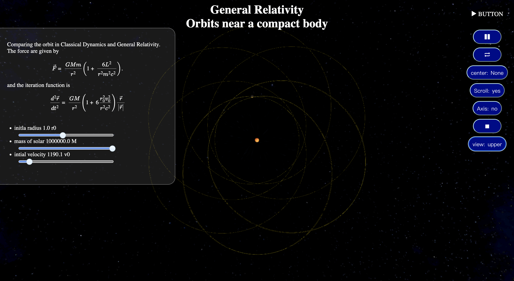
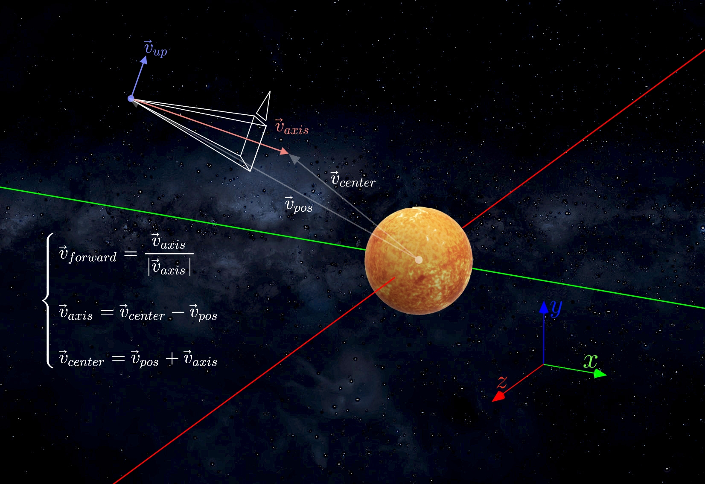

# Precession orbit in General Relativity 

<div style="font-size:10pt;text-align:right;">
author：楊長茂、蘇唯善、高唯恩
<br>
report url: <a href="https://www.canva.com/design/DAFWbm1zd5A/8q6Y0X3fjcTC3bGA7VtE4Q/view?utm_content=DAFWbm1zd5A&utm_campaign=designshare&utm_medium=link&utm_source=publishsharelink">Canvas link</a>
<br>
date:2023/1/3
<br>
Web version: <a href="https://jeffreymaomao.github.io/General_Relativity_Precession.github.io/webGRorbit/main.html" target="_blank">https://jeffreymaomao.github.io/General_Relativity_Precession.github.io/webGRorbit/main.html<a>
</div>


## Analytic Derivation
The exact form of the equation motion near a spheical symmetry black hole with no charge and angular momentum is derived in our Project paper
```
~/GRorbit/Simulation_of_the_Orbit_near_Compact_star.pdf
```
The classical dynamics (C.D.) and general relativity (G.R.) provided that the effective force are


pluggin the intial value $r_0$ and $v_0$, we have the ODE


## Python code

- ```npyMain.py``` is the python code importing package ```vpython``` and ```numpy```
- ```vpyMain.py``` is the python code importing only package ```vpython```


If you don't already have packages ```vpython```, you need to go to **<u>Windows PowerShell</u>** or **<u>Mac Terminal</u>**. Then type
```
pip install vpython
```
or
```
pip3 install vpython
```
You may
1. excute the python code directly.
2. ```cd ~/GRorbit``` then ```python3 npyMain.py``` or ```python3 vpyMain.py```

python: <a href="https://www.python.org">https://www.python.org</a>
vpython: <a href="https://www.glowscript.org/docs/VPythonDocs/index.html">https://www.glowscript.org/docs/VPythonDocs/index.html</a>

## Interface

### graph place
1. The orange sphere represent the solar in this system.
2. The sphere with trail represent the planet in this system.
3. background
    - If your computer system is Mac OS, the blackground would be Milky Way.
    - If your computer system is Windows, the blackground would be black.
### Buttons
We have many buttons to control the scene
1. pause/run icon: is to run the iteration.
2. cycle icon: is to initalize all the iteration and trail.
3. center: 
    1. None: You may control the camera as in the spaceship.
    2. Solar: The center of view will lock on solar. 
    3. Planet: The center of view will lock on planet. 
4. Scroll: is to toogle the scroll option of user.
5. Axis: is to toogle showing the axis arow.
6. Stop icon: is to stop the entire iteration, but still may rotate the scene.
7. view: is to move camera to upper of system, same plane of system or none to control.
### Slider
The sliders are use to control the intial value, so it would stop updating to reset the intial radius, velocity or mass. 
### 
## Scene coordinate
The scene coordinate are also given in <a href="https://www.glowscript.org/docs/VPythonDocs/canvas.html"> vpython API</a>



