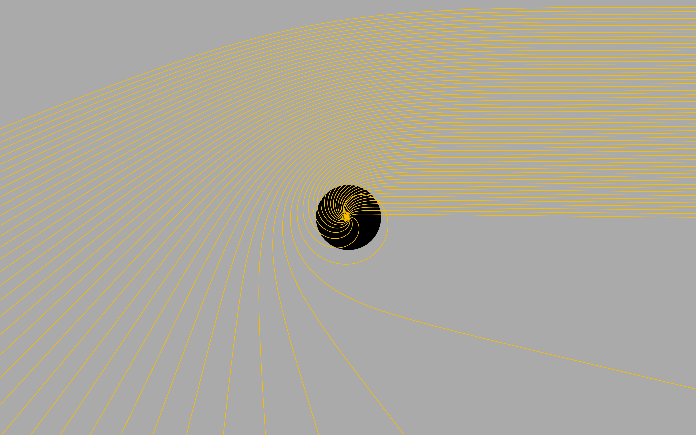

# game.github.io
 
## [Gravitational Lensing game](https://jeffreymaomao.github.io/game.github.io/GRlensing/index.html)
> - landuage: `HTML`,`CSS`,`JavaScript`
> - ODE solve: Classical 4-stage Runge-Kutta method
> - web app: [https://jeffreymaomao.github.io/game.github.io/GRlensing/index.html](https://jeffreymaomao.github.io/game.github.io/GRlensing/index.html)

Visualization of the motion of photon near by Schwarzschild black hole. Using Schwarzschild metirc derive the Gravitational lensing formula

$$\cfrac{du}{d\phi}-u = \cfrac{3GM}{c^2}u^2,\quad u=\cfrac{1}{r},$$

which is a non-linear ODE, and I using Classical 4-stage Runge-Kutta method to solve every photon shoot from right hand side to left hand side. 

Notice that near $2.6\,R_s$ is photon sphere, and the solution may easily diverge. ($R_s$ is the Schwarzschild Radius).

$$R_s = \cfrac{2GM}{c^2}$$

## [General Relativity Precession](https://jeffreymaomao.github.io/game.github.io/GRprecession/webGRorbit/main.html)
> - landuage: `HTML`,`CSS`,`JavaScript`/`Python`
> - ODE solve: 1~4 stage Runge-Kutta method
> - web app: [https://jeffreymaomao.github.io/game.github.io/GRprecession/webGRorbit/main.html](https://jeffreymaomao.github.io/game.github.io/GRprecession/webGRorbit/main.html)
> - python app: [https://jeffreymaomao.github.io/game.github.io/GRprecession/pyGRorbit/](https://jeffreymaomao.github.io/game.github.io/GRprecession/pyGRorbit/)

 When a planet comes into close proximity with a compact object, its orbit begins to precess, a phenomenon which can be explained by the principles of General Relativity. In the course "**General Physics Experiment (I)**" that I took in the second semester of sophomore year, we need to make a final project. Our group chose this phenomenon to simulate, using `Python`'s package called `VPython` that we learn in this course. However, it is not convenient for those who don't have Python, also using python can not customize the UI (User Interface). After the course, I rewrite all the project into web app, so user may start this app only click the url. 

In this project, the motion of planet si descibed by

$$\cfrac{d^2\vec{r}^2}{dt^2} = \cfrac{GM}{r^2}\left(1+\cfrac{6L^2}{m^2r^2c^2}\right),$$

where $\vec{r}$ is the position vector of planet, $G$ is gravitational constant, $c$ is speed of light, $M$ is the mass of compact start, $L$ is the angular momentum of compact star and $m$ is the mass of planet.

## [Dragable balls game](https://jeffreymaomao.github.io/game.github.io/dragBall/index.html)
> - landuage: `HTML`,`CSS`,`JavaScript`
> - ODE solve: Euler method
> - web app: [https://jeffreymaomao.github.io/game.github.io/dragBall/index.html](https://jeffreymaomao.github.io/game.github.io/dragBall/index.html)

In the course "**General Physics Experiment (II)**" that I took in the first semester of the junior year, we need to make a simple game that user can manipulate the position and motion of the ball by drag it. Therefore I wrote this simple game using some web language. In the web app, every ball following the motion described by
$$\displaystyle \cfrac{d^2\vec{r}}{dt^2} = -\cfrac{b}{m} \cfrac{d\vec{r}}{dt}, \quad b>0,$$
where $\vec{r}$ is the postion vector of the ball, $m$ is the mass of the ball and $b$ is drag coefficient.

## [Running game](https://jeffreymaomao.github.io/game.github.io/GRlensing/index.html)
> - landuage: `HTML`,`CSS`,`JavaScript`
> - web app: [https://jeffreymaomao.github.io/game.github.io/GRlensing/index.html](https://jeffreymaomao.github.io/game.github.io/GRlensing/index.html)

 In the course "**Introduction to Game Design**" that I took in the second semester of my sophomore year, 
we need to make a final project with a simple game. The language we use in the course is `Lua`. 
However, making a web app is more convenient for user, I wrote this simple game using some web language.
